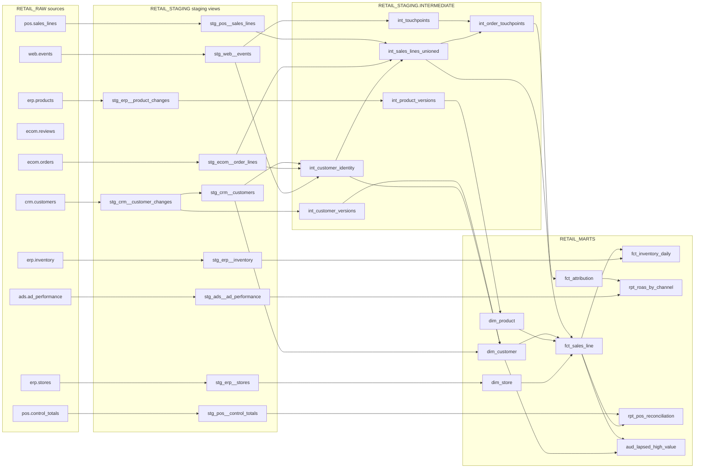

# dbt_retail

The transformation layer of RetailOne: **RAW → staging → intermediate → marts**, with SCD2, identity resolution,
three attribution models (SQL + Python/Snowpark), reconciliation, contracts and tests.

The guided walkthrough lives in [stage_04_dbt_snowpark/README.md](../../stage_04_dbt_snowpark/README.md).
This page is the reference.

## Lineage



## Where things land

| Layer | dev target (default) | prod target |
| --- | --- | --- |
| staging views | `RETAIL_DEV.DBT_<YOU>_POS`, `…_CRM`, … | `RETAIL_STAGING.POS`, `.CRM`, … |
| intermediate | `RETAIL_DEV.DBT_<YOU>_INTERMEDIATE` | `RETAIL_STAGING.INTERMEDIATE` |
| marts | `RETAIL_DEV.DBT_<YOU>_CORE` / `_SALES` / `_MARKETING` / `_OPS` | `RETAIL_MARTS.CORE` / `.SALES` / `.MARKETING` / `.OPS` |
| seeds / snapshots | `RETAIL_DEV.DBT_<YOU>_SEEDS` / `_SNAPSHOTS` | `RETAIL_STAGING.SEEDS` / `.SNAPSHOTS` |
| ci target | — | clones `RETAIL_STAGING_<suffix>`, `RETAIL_MARTS_<suffix>` |

Controlled by [macros/generate_database_name.sql](macros/generate_database_name.sql) and [macros/generate_schema_name.sql](macros/generate_schema_name.sql).

## Everyday commands (run from this folder, `.env` loaded)

```powershell
cd capstone_retail_platform/dbt_retail
dbt debug                                   # connection + profile check
dbt deps                                    # install dbt_utils, dbt_expectations
dbt seed                                    # load channels.csv, promotions.csv
dbt build                                   # seeds + snapshots + models + tests, in DAG order (dev)
dbt build --select staging                  # one folder
dbt build --select +fct_sales_line          # a model and everything upstream
dbt build --select fct_sales_line+          # a model and everything downstream
dbt test --select tag:reconciliation        # just the reconciliation test
dbt source freshness                        # are sources arriving on time?
dbt docs generate; dbt docs serve           # lineage + docs site on http://localhost:8080
dbt build --target prod                     # production build (what Airflow runs)
```

Incremental controls:

```powershell
dbt build -s fct_sales_line --full-refresh                                               # rebuild from scratch
dbt build -s fct_sales_line --vars "{backfill_start: '2026-08-01', backfill_end: '2026-08-31'}"   # re-merge a date range
dbt build -s fct_sales_line --vars "{lookback_days: 7}"                                  # wider late-data window once
```

## Variables (dbt_project.yml)

| var | default | meaning |
| --- | --- | --- |
| `lookback_days` | 3 | incremental models reprocess rows loaded in the last N days |
| `reconciliation_tolerance` | 0.005 | store-day fails if warehouse differs from POS Z-report by > 0.5% |
| `attribution_window_days` | 7 | touches up to N days before an order count |
| `time_decay_half_life_hours` | 48 | time-decay attribution half-life |
| `enable_governance` | false | Stage 7: post-hooks tag PII columns and attach the row access policy |
| `enable_cortex` | false | Stage 8: Cortex sentiment model on reviews |

## Conventions

See [STANDARDS.md](../../STANDARDS.md). Short version: `stg_<source>__<entity>` (views, 1:1 with sources),
`int_` (business logic), `dim_`/`fct_` (marts, tested, documented), `rpt_` (reports), `aud_` (activation audiences).
Every model has a primary-key test; every fact FK has a `relationships` test; marts that BI depends on have contracts.

## Troubleshooting

| Problem | Fix |
| --- | --- |
| `Env var required but not provided: 'SNOWFLAKE_ACCOUNT'` | Load `.env`: `. ..\..\00_setup\load_env.ps1` |
| `Could not find profile named 'dbt_retail'` | Run dbt from this folder (profiles.yml is here) or set `DBT_PROFILES_DIR` |
| Python model: `Anaconda terms … not accepted` | Snowsight → Admin → Billing & Terms → Anaconda → Acknowledge (ORGADMIN) |
| Contract error `data type mismatch` | The SELECT's casts must match `data_type` in YAML exactly (names and order) |
| Reconciliation test fails | `select * from <marts>.OPS.RPT_POS_RECONCILIATION where status <> 'OK'` → late or bad POS file? |
| VSCode shows red "syntax errors" in `.sql` files | A plain-SQL linter doesn't understand Jinja. Install **dbt Power User** and set the language mode to *Jinja SQL* |
