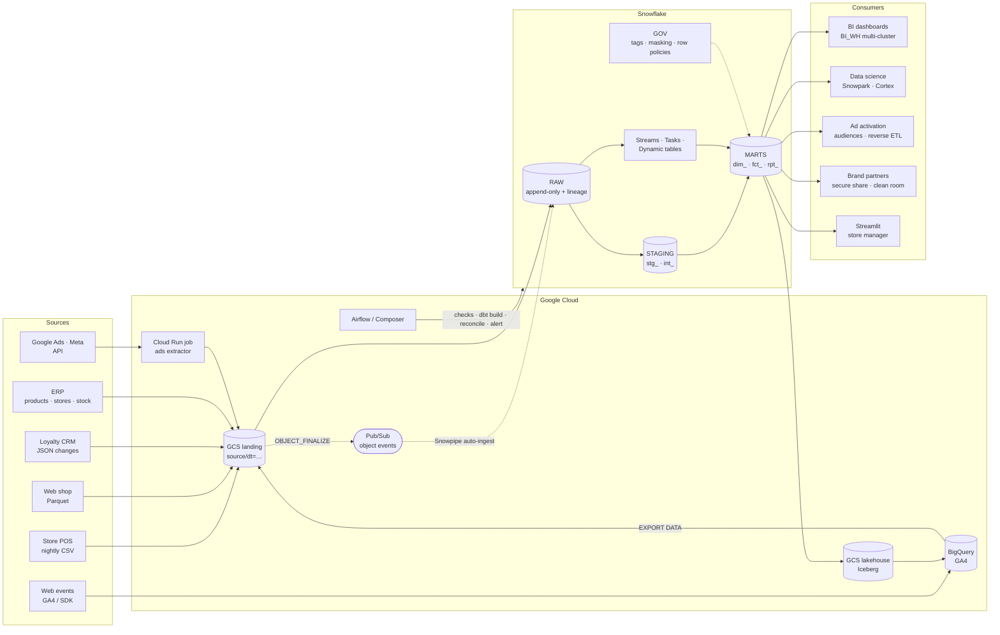

# RetailOne data platform — architecture

**Scenario.** RetailOne runs 20 stores in Kenya and Qatar, an online shop, a loyalty app, and paid ads on Google and Meta.
Leadership wants daily sales and margin by store, a single customer view across store and online, marketing ROI by
channel, and live stock for flash sales.

## The picture (draw it left to right)

## The seven beats (≤ 4 minutes, out loud)

1. **Clarify** — freshness (finance daily, stock near-real-time), volumes (stores, lines/day, history), consumers (BI, DS, ads team).
2. **Sources** — POS (lines + Z-report totals), e-commerce, CRM/loyalty (PII, consent), ERP, ads APIs, web/GA4.
3. **Ingestion on GCP** — everything lands in a GCS landing bucket by `source/dt=`; immutable files are our replay source.
   Storage integration (no keys) + Pub/Sub notification integration → **Snowpipe auto-ingest**. Ads via **Cloud Run** jobs;
   GA4 stays in BigQuery and is exported; CDC via Datastream/connector; streaming POS via **Snowpipe Streaming** if needed.
4. **Layers** — RAW (exact copy, `VARIANT` for JSON, `_file_name/_loaded_at`) → STAGING (typed, deduped) → INTERMEDIATE
   (identity resolution, SCD2 versions, attribution input) → MARTS (stars by domain).
5. **Model** — `fct_sales_line` at line grain (returns negative), point-in-time joins to SCD2 `dim_customer` and `dim_product`;
   one **conformed customer** across loyalty card and email; `fct_inventory_daily` (semi-additive), `fct_ad_performance`,
   `fct_attribution` (last-click, linear, time-decay).
6. **Serving** — BI on `BI_WH` (multi-cluster), Snowpark/Cortex for DS, lapsed-high-value audiences for activation,
   secure shares + clean rooms for brand partners, Streamlit for store managers.
7. **Operating** — Airflow (arrival check → dbt build → reconciliation → alert); streams/tasks/dynamic tables for live stock;
   per-workload warehouses with resource monitors; clustering on `(sale_date, store_id)`; tests, freshness, contracts,
   reconciliation within 0.5%; RBAC + tag-based masking + region row policy; Terraform + CI on zero-copy clones.

## Decisions and trade-offs (the decision log)

| # | Decision | Options considered | Why this one | Revisit when |
| --- | --- | --- | --- | --- |
| 1 | Land every source in GCS first | Direct connectors into Snowflake | Replayable, auditable, decoupled from warehouse; same pattern for all sources | A managed connector covers a source end-to-end with CDC |
| 2 | Snowpipe auto-ingest for files | Scheduled COPY from Airflow | Event-driven, serverless, minutes latency, no warehouse | Files become huge/rare (COPY cheaper) or rows need seconds (Streaming) |
| 3 | JSON → VARIANT in RAW | Typed RAW tables for JSON | Never breaks on new keys; staging decides what to extract | — |
| 4 | SCD2 rebuilt from RAW change history | dbt snapshots only | Exact change timestamps, rebuildable, testable | Sources stop sending changes (snapshots then) |
| 5 | Incremental fact on `_loaded_at` + 3-day lookback + merge | Business-date filter | Handles late and re-sent files without duplicates | Volume makes MERGE expensive → microbatch |
| 6 | Reconciliation against POS Z-report blocks publishing | Row-count checks only | Finance trusts numbers that tie to the till | — |
| 7 | Live stock via Dynamic Table (5 min) | Stream + task, Airflow every 5 min | Declarative, incremental refresh, no scheduler code | Need custom side effects |
| 8 | Masking at MARTS by tag; RAW/STAGING protected by RBAC | Mask everywhere | Pipelines must move real values; people never query RAW | — |
| 9 | Row policy via mapping table | Secure views per region | One table, one rule, access = a row | — |
| 10 | Terraform for account objects; migrations + dbt for schema objects | All in Terraform | Different change rates and owners | — |
| 11 | CI on zero-copy clones, slim builds | Shared dev database | Isolated, prod-like, fast, cheap | — |
| 12 | Iceberg copy of daily sales on our bucket | Everything native | Open format for BigQuery/Spark consumers, avoids lock-in | Catalog strategy decided org-wide |

## SLAs and ownership

| Mart | Owner | Freshness SLA | Quality gate |
| --- | --- | --- | --- |
| `fct_sales_line`, `fct_inventory_daily` | Data platform | 06:00 store time for D-1 | Reconciliation within 0.5% per store-day; PK/FK tests |
| `STORE_STOCK_LIVE` | Data platform | ≤ 5 minutes lag | Dynamic table refresh history; DMF on RAW freshness |
| `fct_attribution`, `rpt_roas_by_channel` | Marketing analytics | 08:00 for D-1 | Credits sum to 1 per order per model |
| `aud_lapsed_high_value` | Marketing ops | Daily | Consent filter; PII masked except marketing |

## At 100× the volume

See [stage_08_advanced/architecture_judgement.md](../../stage_08_advanced/architecture_judgement.md#what-would-you-change-at-100-the-volume-final-capstone-question).
